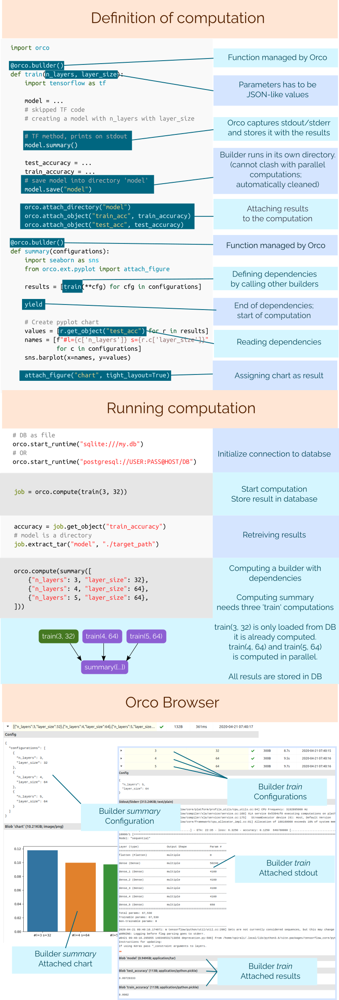

# ORCO

ORCO (Organized Computing) is a Python package for defining, executing and persisting
computations in a straightforward fashion.

If you often find yourself in a situation where you need to:
 - run many computations with various combinations of input parameters
 - easily distribute the computation among many cores
 - persist the results to disk in a structured way
 - define dependencies between computations and pipeline them together
 - avoid recomputing already executed computations when you add new inputs
 - observe the status of the computations while they are running

then ORCO is the right tool for you.

ORCO prevents problems like accidentally overwriting data, computing already
computed data, non-invalidating old computations when the input data are
changed, overwriting data in simultaneous computations.

ORCO combines an execution engine for running computations with a database that
stores their results and allows you to query them. It forces you to be very
explicit in specifying how is your computation defined and what are its
dependencies. This makes the code a bit verbose, but facilitates reproducibility
of your experiments.

## Links

* [User guide](https://spirali.github.io/orco.pages/userguide/userguide)
* [API reference](https://spirali.github.io/orco.pages/api/)

## License

[MIT](LICENSE)

## Example

