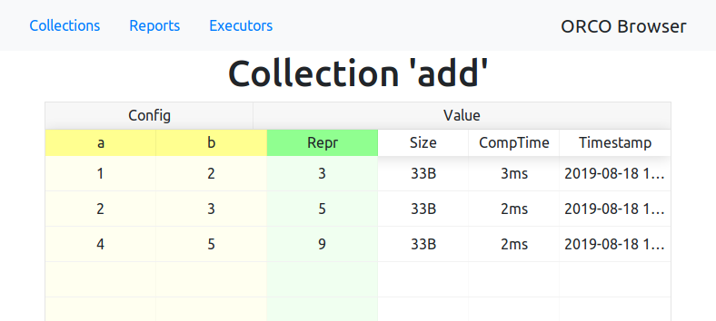

# Getting started

## Example 1: Adder

In this example we will define a simple computation that adds two numbers. After
you run the computation, its results will be stored in a database to avoid
recomputation in the future.

The database with computation results is represented by a `Runtime`, which
receives a path to a database file where the results will be stored.
In this chapter, we use a default 'job runner' that executes task locally.
It is spawned automatically by the runtime, so no further action is needed.

As a database backend, you can use all databases supported by
[SqlAlchemy](https://docs.sqlalchemy.org). For this text we will use SQLite, as
it does not need any configuration.

In this chapter, we will also use one global Runtime, but ORCO is ready to having
more non-global runtimes at once on one or more databases.


```python
import orco

# Create a new global runtime
# If the database file does not exist, it will be created
orco.start_runtime("sqlite:///my.db")

# Use can use "sqlite:////" prefix for abolute path

# For using Postgress, you can use the following:
# orco.start_runtime("postgresql://<USERNAME>:<PASSWORD>@<HOSTNAME>/<DATABASE>")
```

Now we can start defining your computations. Computations in ORCO are defined as
**builder**s. A builder defines and stores the results of a single type of
computation (preparing a dataset, training a neural network, benchmarking or
compiling a program, ...).

Let's define a trivial builder that will returns of a computation which simply adds two numbers.

```python
import orco

@orco.builder()
def add(a, b):
    return a + b

orco.start_runtime("sqlite:///my.db")
# Note: It is ok to define builders before or after `start_runtime`
```

The builder is basically a wrapper around a function which result will be automatically persisted.
Builder has some additional qualities that we will see later.

We call input arguments of a builder as a **configuration** of builder.
Configuration has to be always composed only from to be JSON seriazable types
(numbers, strings, booleans, lists, tuples or dictionaries). So it can be serialized with the result.

ORCO also always assumes that configuration fully describe the computation. This
is important idea behind the concept of ORCO. It allows to prevent recomputing
already computed data and reconstruct the computation when needed.

We have now defined a database for storing computation results,
a builder that defines a simple `add` computation
and two configurations for `add` that we want to compute.

To invoke a computation we need to create an **job**.
Job is created by calling a builder. Calling a builder is a very lightweight operation that just creates a reference
to a computation without invoking a builder's function.
To really invoke a computation we need to call ``orco.compute(job)``.
After the computation is over, we can read job's ``value``.

```python
# Compute the result of `add` with the input `config_1`
job = add(1, 2)
orco.compute(job)
print(job.value)  # prints: 3

# Comment: orco.compute returns the first given argument, so the example
# can be written also as:
#
# job = orco.compute(adder(1, 2))
# print(job.value)  # prints: 3
#
# We use both variants in this text.
```

Each builder establish a persistent cache for each builder that is stored in the
database. Because this was the first time we asked for this specific
computation, the build function was invoked with the given configuration and its
return value was stored into the database. When we run the same computation
again, the result will be provided directly from the database.

```python
orco.compute(add(1, 2))  # Builder's function is not called now, it just load the result from DB
```

So far we have computed only one configuration, usually you want to compute many of them
```python
jobs = orco.compute_many([add(1, 2),
                          add(2, 3),
                          add(4, 5)])
print([r.value for r in jobs])  # prints: [3, 5, 9]]
```

Computing more instances at once allows to paralelize the computation and reduce an overhead of starting a computation.

This concludes basic ORCO usage. You define a builder with a build function and ask the builder
to give you results for your desired configurations.

The whole code example is listed here:

```python
import orco


# Build function for our configurations
@orco.builder()
def add(a, b):
    return a + b


# Create a runtime environment for ORCO.
# All data will be stored in file on provided path.
# If file does not exists, it is created
orco.start_runtime("sqlite:///my.db")

# Invoke computations, builder.ref(...) creates a "reference into a builder",
# basically a pair (builder, config)
# When reference is provided, compute returns instance of Entry that
# contains attribute 'value' with the result of build function.
job = orco.compute(add(1, 2))
print(job.value)  # prints: 3

# Invoke more compututations at once
result = orco.compute_many([add(1, 2),
                            add(2, 3),
                            add(4, 5)])
print([r.value for r in result])  # prints: [3, 5, 9]
```


## Example 2: Dependencies

ORCO allows you to define dependencies between computations. When a computation
`A` depends on a computation `B`, `A` will be executed only after `B` has been
completed and the result of `B` will be passed as an additional input to `A`.

In the example, assume that we have an expensive simulation. For the sake of
simplicity, we will parametrize it by one parameter `p`.

We define builder of simulations as follows:

```python
import orco
import time
import random

@orco.builder()
def simulation(p):
    # Fake a computation
    result = random.randint(0, p)
    time.sleep(1)
    return result
```

Now we define an "experiment" that includes a range of simulations that has to
be performed together with some post-processing.

Because we want share simulations between experiments, experiment itself will
not perform the computation, but establish an dependency on "simulation" builder.

```python


# Run experiment, sum resulting values as demonstration of a postprocessing
# of simulation
@orco.builder()
def experiment(start, end):
    sims = [simulation(p) for p in range(start, end)]
    yield
    return sum([s.value for s in sims])
```

When dependencies are used, there are two phases:

* Inputs gathering (before ``yield``)
* Computation (after ``yeild``)

We can call other builders in the first phase. They are gathered as dependencies
for the computation. This phase should be quick without any heavy computation.
This phase is possibly invoked more than once.

The second phase is computation phase where the main part of the computation
should happen. ORCO guarantees that all jobs created in the first phase is
successfully finished. Hence we may freely access its .value attribute.
On the other hand, it is
not allowed to create new jobs by calling builders (an exception is thrown in
such case). All dependencies has to be created in the first phase.

Now if we run:

```python

orco.start_runtime("sqlite:///my.db")

# Run experiment with with simulation between [0, 10).
orco.compute(experiment(0, 10))
```

The output will be as follows:

```
Scheduled jobs   |     # | Expected comp. time (per entry)
-----------------+-------+--------------------------------
experiment       |     1 | N/A
simulation       |    10 | N/A
-----------------+-------+--------------------------------
100%|██████████████████████████████████| 11/11 [00:03<00:00,  3.63it/s]
```

We see, that system performs one computation from builder "experiment" and ten
from "simulation". Simulations are automatically scheduled as a result of
experiment dependency. Since our DB is empty, we have no prior information about
computation time, the expected computation makespan is not available (third
column in the output).

Lets us now run the following:

```python
# Run experiment with with simulation between [7, 15).
orco.compute(experiment(7, 15))
```

The output will be following:

```
Scheduled jobs   |     # | Expected comp. time (per entry)
-----------------+-------+--------------------------------
experiment       |     1 |      1ms +- 0ms
simulation       |     5 |     1.0s +- 1ms
-----------------+-------+--------------------------------
100%|███████████████████████████████████| 6/6 [00:02<00:00,  2.95it/s]
```

ORCO schedules five simulations, because simulations for parameters 7, 8, and 9
are already computed. We need to only compute five simulations in range 10-14.
Now we also see expected computation times for jobs because we already have some
results in the DB.

## ORCO browser

ORCO contains a web browser of computations and their results stored in the database.
It can be started by running:

```python
orco.serve()
```

`serve` starts a local HTTP server (by default on port 8550) that allows inspecting
stored data in the database and observing jobs running in executors. It is completely safe to run computation(s) simultaneously with the server.



(The `serve` method is blocking. If you want to start the browser and run computations in the same script,
you can call `serve(daemon=True)` before calling `compute` on the `Runtime`.)

Continue to [CLI interface](cli.md)
